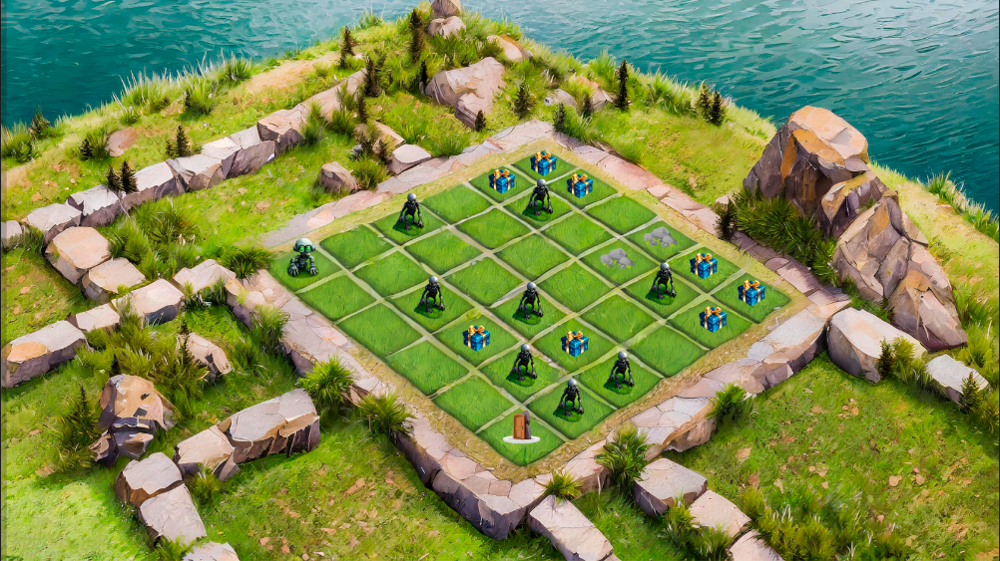

# Inteligência Artificial

## Implementação - Reinforcement Learning

Vamos criar um algoritmo de reinforcement learning (aprendizado por reforço) inspirado no jogo "The Last of Us”. Neste cenário, nosso agente será um sobrevivente em um ambiente pós-apocalíptico infestado por zumbis. 

O objetivo do agente é maximizar sua recompensa acumulada ao longo do tempo, coletando suprimentos (comida, água, medicamentos) e evitando zumbis.

## Ambiente

* O ambiente é um grid 2D que representa a área pós-apocalíptica;

* Cada célula do grid pode conter um dos seguintes elementos: agente, zumbi, parede, pedras, suprimento (comida, água, medicamentos..), porta (área segura) ou espaço vazio.

## Ações do Agente

* O agente pode executar quatro ações: mover para cima, mover para baixo, mover para a esquerda e mover para a direita;

* O agente pode realizar uma ação por vez e se mover para uma célula adjacente no grid.

## Recompensas

* O agente recebe recompensas com base em suas ações no ambiente;
* +10 pontos para cada suprimento coletado;
* -10 pontos para cada encontro com um zumbi;
* O episódio termina após um número fixo de passos, quando o agente é capturado por um zumbi ou quando alcança uma área segura.

O algoritmo escolhido para lidar com o problema proposto é a Busca em Largura. A busca em largura (BFS, Breadth-First Search) é um algoritmo usado em grafos para percorrer ou pesquisar todos os vértices (ou nós) de um grafo de maneira sistemática e nivelada. Em vez de explorar profundamente um ramo específico do grafo, como faz a busca em profundidade (DFS), a BFS expande a busca a partir do nó inicial para todos os nós vizinhos antes de passar para os nós mais distantes.

Os materiais base para a implementação do algoritmo são:

https://www.geeksforgeeks.org/breadth-first-traversal-bfs-on-a-2d-array/

https://www.youtube.com/watch?v=oDqjPvD54Ss

https://www.youtube.com/watch?v=KiCBXu4P-2Y
